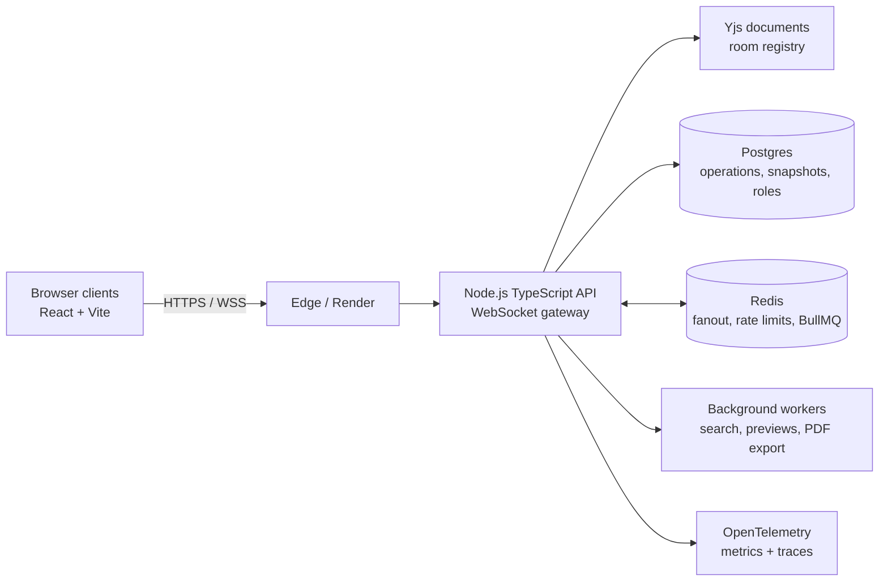
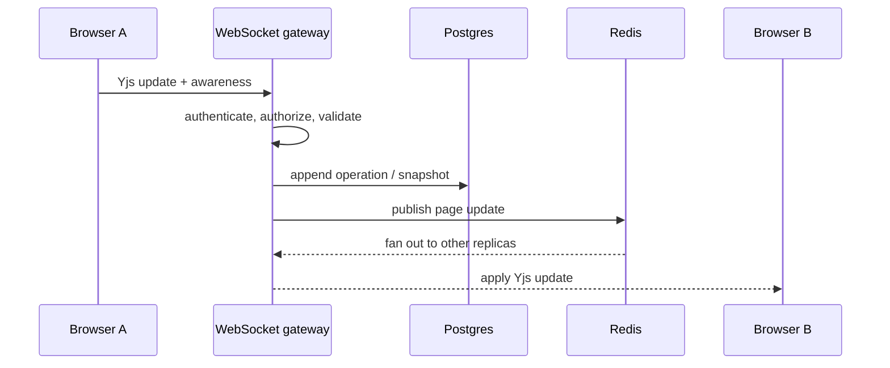

# Collab Workspace

[](https://github.com/kaushik-3009/DocSync/actions/workflows/ci.yml)
[](LICENSE)

Collab Workspace is a real-time document editor built around a production-minded synchronization core. Multiple people can edit rich text, code blocks, and a drawing canvas in the same document while the system handles concurrent updates, reconnects, access control, persistence, and horizontal scaling.

This is a systems project presented as a product: the editor is the interface, but the engineering challenge is the consistency model underneath it.

## Why this project exists

Real-time collaboration is easy to demonstrate and difficult to make dependable. A useful implementation must remain coherent when edits arrive concurrently, a browser sleeps, a connection drops, a server restarts, or traffic moves between replicas. This project uses those failure modes as first-class design constraints rather than treating the WebSocket as a thin transport layer.

## Product surface

- Shared block documents with live presence and remote cursors
- Collaborative CodeMirror 6 code blocks and tldraw canvas blocks
- JWT authentication and server-side owner/editor/viewer permissions
- Append-only operations, snapshots, version history, and restore
- Comments, @mentions, search, link previews, and PDF export jobs
- Rate limiting, structured logs, metrics, and OpenTelemetry tracing
- Graceful capability degradation when optional infrastructure is unavailable

## Architecture



The synchronization path is deliberately small: clients exchange Yjs updates through the gateway; Postgres provides durable history; Redis propagates updates between replicas. Authorization is evaluated on the server before mutations are accepted.

### Data flow for an edit



## Technology

| Layer | Choice |
| --- | --- |
| Client | React 18, Vite, CodeMirror 6, tldraw, Yjs |
| Server | Node.js, TypeScript, `ws`, Yjs, pino |
| Persistence | PostgreSQL, append-only operations and snapshots |
| Coordination | Redis, BullMQ, `rate-limiter-flexible` |
| Observability | Prometheus, Grafana, OpenTelemetry, Jaeger |
| Delivery | Render Blueprint or Docker Compose for local infrastructure |
| Verification | Vitest, pg-mem, ioredis-mock, k6 |

## Performance snapshot

Measured locally with k6 against the in-memory server. These are reference measurements, not a production SLA.

| Scenario | Result |
| --- | ---: |
| `/health`, 50 virtual users | ~956 requests/s; p95 3.89 ms; 0% failures |
| Rate-limit budget, 20 virtual users | 120 accepted, subsequent requests rejected; p95 2.47 ms |
| WebSocket connection test, 25 clients | 100% success; p95 12–37 ms depending on room sharing |

## Deploy everything on Render

The repository includes [`render.yaml`](render.yaml), which provisions a Node web service, a static React site, PostgreSQL, and Redis. No local Docker installation is required.

1. Push the repository to GitHub.
2. In Render, choose **New → Blueprint** and select the repository.
3. Review the services and create the blueprint.
4. After Render creates the services, open `collab-workspace-api` and set `ALLOWED_ORIGINS` to the final frontend URL, for example `https://collab-workspace-client.onrender.com`.
5. Open `collab-workspace-client` and set `VITE_WS_URL` to the API WebSocket URL, for example `wss://collab-workspace-api.onrender.com/ws`.
6. Trigger a new frontend deploy after setting `VITE_WS_URL`; Vite embeds this value at build time.

For a custom domain, attach `app.example.com` to the static site and `api.example.com` to the API service, then use:

```text
ALLOWED_ORIGINS=https://app.example.com
VITE_WS_URL=wss://api.example.com/ws
```

Keep `JWT_SECRET`, database credentials, and Redis credentials in Render-managed environment variables. Never commit `.env` or production secrets.

## Run locally

Requirements: Node.js 20+ and pnpm.

```bash
pnpm install
pnpm dev:server   # in-memory mode on :1234
pnpm dev:client   # http://localhost:5173
```

For the complete local infrastructure stack:

```bash
cp .env.example .env
docker compose up --build -d
```

## Verification

```bash
pnpm build
pnpm test
```

The test suite covers persistence adapters, authentication, permissions, WebSocket behavior, rate limiting, and concurrent-edit convergence. Load scripts live in [`loadtest/`](loadtest/).

## Repository map

```text
packages/shared   Shared document schema and wire types
packages/server   WebSocket gateway, auth/RBAC, persistence, jobs, telemetry
packages/client   React editor, presence UI, comments, history, export controls
loadtest/         k6 HTTP and WebSocket scenarios
docs/             Design notes and operational documentation
render.yaml       Render deployment blueprint
docker-compose.yml Local multi-service infrastructure
```

## Engineering decisions

- Yjs CRDTs provide deterministic convergence for concurrent edits without a central operation-transform loop.
- Postgres is the durability boundary; Redis is coordination and fanout, not the source of truth.
- Optional integrations are feature-gated so the core editor remains testable in memory.
- RBAC and input validation live on the server because a client-generated update is untrusted input.
- The deployment model is intentionally replica-safe: no sticky sessions are required for document synchronization.

## Roadmap

- Move background workers into independently scaled services.
- Replace `ILIKE` search with a dedicated Postgres full-text index.
- Add sandboxed, resource-limited code execution for code blocks.
- Add a production browser test matrix and long-running soak tests.

## Contributing

```bash
cp .env.example .env
pnpm install
pnpm build
pnpm test
```

Open an issue for design discussion or a pull request with tests for behavior changes.

## License

MIT. See [`LICENSE`](LICENSE).
